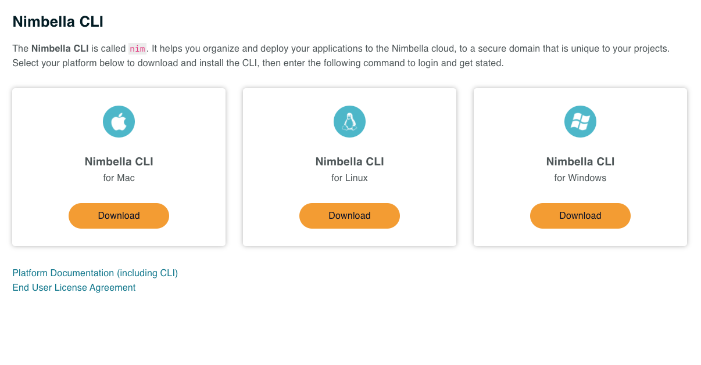
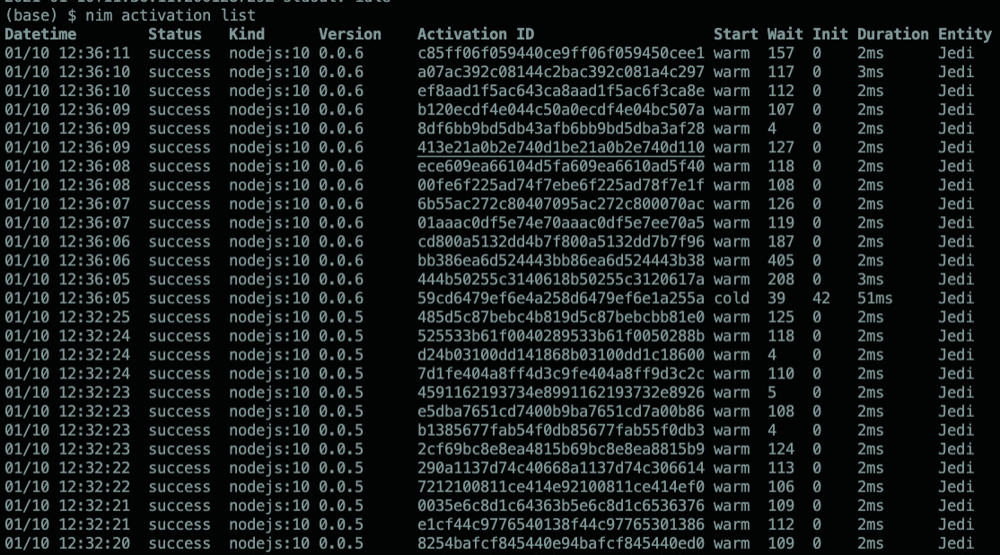
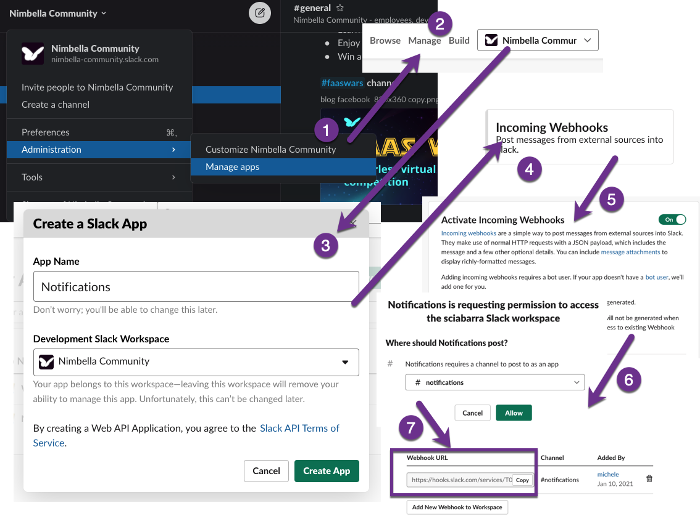

# **Lesson 1**

Jump Start with Nimbella

https://www.nimbella.com

---
# Plan

- signup with nimbella
- creating an action with FAAS Wars
- installing using the `nim` cli
- checking activation logs and results

---


---
# Install nim cli



---
!

---
# Inspecting Actions

- `nim action list` 
list actions
- `nim action get <name>` 
get informations about an action
- `nim action get <name> --url` 
get the public url of an action

---
```sh
# Inspecting the action
nim action list
nim action get Jedi
nim action get Jedi --url 
```

---
# Action invocation with nim

##  with `action invoke`: 
- `nim action invoke <action-name> <parameters>`

## `<parameters>`:
- `-p <name> <value> ...`
can be repeated multiple times
- `-P <file>.json`
you need a file in json format

---
# Action invocation with `curl` 

## only for web actions!

- `--web true`  
  - web public it is the default with `nim`
  - **not** all the actions are web public

## use url-encoded parameters

- `curl -X GET <url>?event=hit`
- `curl -X POST -d  event=hit <url>`

---
```sh
# Invoking an action with parameters

nim action invoke Jedi -p event idle
nim action invoke Jedi -p event hit
nim action invoke Jedi -p event enemy-spot
nim action invoke Jedi -p event wall-collide

# invoking an action with json

echo '{ "event": "idle"}' >args.json
nim action invoke Jedi -P args.json
```

---
```sh
# Using Curl  for web actions

URL=$(nim action get Jedi --url)

# use GET and url parameters

curl "$URL?event=hit"

## use POST and form data (url-encoded)

curl -X POST -d event=hit "$URL"
```

---
# Updating an Action

- `nim action update <name> <file>`
   - works also if the action does not exists
   - some people only use `update`

---
```js
/*
nim action update Jedi jedi.js
*/
function main(args) {
    console.log(args.event)
    return body: [
        {"turn_turret_left": 15, "shoot": true}
    ]
}
```

---
# Checking Activations

- `nim activation list [--limit <n>]`
list actions, you can limit them

- `nim activation logs [<id>]`
show logs of an activation

- `nim activation result [<id>]`
show logs of an activation

---
```sh
nim activation list
nim action invoke Jedi -p event idle
nim activation list --limit 3

nim activation logs
nim activation result
```

---


---


---
# Managing Packages

- `nim package create greetings`
create a package

- `nim action create greetings/hello hello.js`
create an action in the package

- `nim action remove greetings -r`
remove package and all its actions

---
```sh
# create package with 2 actions
nim package create greetings
nim action create greetings/hello hello.js
nim action create greetings/hi hi.js
nim action list
nim package delete greetings
nim package delete greetings -r
nim action list
```

---
# Package variables

- `nim package update -p name Mike`

## available to all actions

- useful to share configurations
- action variables overrides package variables

---
```sh
# create package without variables
nim package create greetings
nim action create greetings/hello hello.js
nim action create greetings/hi hi.js

# no variables, default
nim action invoke greetings/hello
nim action invoke greetings/hi
```

---
```sh
# override package variable
nim package update greetings -p name Mike
nim action invoke greetings/hello
nim action invoke greetings/hi

# override action variable
nim action update greetings/hi -p name Michele
nim action invoke greetings/hello
nim action invoke greetings/hi
```

---
# Shared Packages in namespace `whisk-system`

-  you can share your package with others:
`nim action create <package> --shared=yes`

- shared (system) packages:
`nim packages list /whisk-system`


---
# Example: a "slack" notification action

1. Creating a slack URL
1. Passing the URL as package variable
1. Writing messages in the url with an action
1. Profit!


---



---
```sh
source $HOME/.ssh/secret.sh
curl -X POST -d '{"text": "Hello"}' $NOTIFICATIONS
curl -X POST -d '{"text": "How are you"}' $NOTIFICATIONS
```

---
```js
const axios = require('axios').default;

function main(args) {
    let prefix = args.prefix || ""
    let text = args.text || (args.parameters && args.parameters[0].value) || "empty message"
    return axios.post(args.notifications, {
        text: prefix + text
    }).then(r => {
        return {
            "body": r.data
        }
    })
}
```

---
```sh

# Notifications
nim package update checker -p notifications $NOTIFICATIONS
nim action update checker/notify notify.js
nim action invoke checker/notify -p text hello
nim action invoke checker/notify -p text hi
```

---
### Triggers and Rules


---
# Creating a trigger and rules

- `nim trigger create <name>`
create a trigger with the given `<name>`

- `nim rule create <name> <trigger> <action>`
create a rule `<name>` to invoke the `<action>` when firing `<trigger>`

-  `nim rule enable <name>`
`nim rule disable <name>``
enable or disable rules

- `nim trigger fire <name> <parameters>`
fire a trigger with parameters

---
```sh
nim trigger create slack
nim action update checker/first notify.js -p prefix '[first] '
nim rule create slack-first slack checker/first
nim rule enable slack-first
nim trigger fire slack -p text from-trigger-1
```

---
```sh
nim action update checker/second notify.js -p prefix '[second] '
nim rule create slack-second slack checker/second
nim rule enable slack-second
nim trigger fire slack -p text from-trigger-2
nim rule disable slack-first
nim trigger fire slack -p text from-trigger-3
```


---
```sh
nim package list /whisk-system/
nim action list /whisk-system/alarms
nim action get /whisk-system/alarms/interval
```

---
```sh
nim trigger create every-minute --feed /whisk-system/alarms/interval -p minutes 1
nim action update checker/tick tick.js
nim rule create every-minute-tick every-minute checker/tick
nim rule enable every-minute-tick
```
